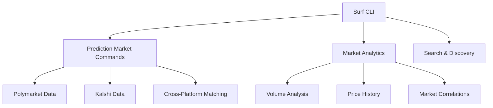

# Prediction Markets Analytics Dashboard

A comprehensive, production-ready analytics platform for prediction markets data from Polymarket and Kalshi. Built with Next.js and powered by the **Surf API** for real-time market insights, cross-platform analysis, and advanced analytics.

> **🎯 Perfect for:** Market researchers, traders, data analysts, and developers building prediction market applications.

## 📊 Live Demo Features

- **📈 Real-time Market Data** - Live prices, volumes, and open interest
- **🔍 Cross-Platform Analysis** - Compare Polymarket vs Kalshi markets
- **📊 Advanced Analytics** - Market correlations, trend analysis, and predictions
- **🤖 Smart Data Collection** - Automated scripts for continuous data gathering
- **📱 Responsive Design** - Works perfectly on desktop and mobile
- **⚡ High Performance** - Optimized for fast loading and smooth interactions

---

## 🚀 Quick Start (5 Minutes)

### Prerequisites
- **Node.js 18+**
- **Surf API Key** - Get yours at [agents.asksurf.ai](https://agents.asksurf.ai)

### Installation
```bash
# 1. Clone the repository
git clone <repo-url>
cd prediction-markets

# 2. Install dependencies
npm install

# 3. Configure environment
cp .env.example .env.local
# Add your SURF_API_KEY to .env.local

# 4. Install surf CLI
curl -fsSL https://agent.asksurf.ai/cli/releases/install.sh | sh
surf login  # Enter your API key

# 5. Collect initial data
make collect

# 6. Start development server
npm run dev
```

Visit [http://localhost:3000](http://localhost:3000) to see your dashboard!

---

## 🏗️ Building with Surf API - Complete Guide

### Step 1: Understanding Surf API Architecture

The Surf API provides **66 specialized commands** across 11 domains for crypto and prediction market data. Here's how this dashboard leverages them:



### Step 2: Core Surf Commands Used

#### 🔍 **Market Discovery & Search**
```bash
# Get all active prediction markets
surf search-prediction-market --limit 100

# Search for specific topics
surf search-prediction-market | jq '.data[] | select(.question | contains("election"))'

# Example Response:
{
  "data": [
    {
      "condition_id": "0x6d0e09d0f04572d9b1adad84703458b0297bc5603b69dccbde93147ee4443246",
      "question": "US forces enter Iran by April 30?",
      "category": "Politics",
      "subcategory": "Military Conflicts",
      "platform": "polymarket",
      "latest_price": 0.8,
      "volume_30d": 275698932.57,
      "open_interest_usd": 123900216.42,
      "status": "active"
    }
  ]
}
```

#### 📊 **Polymarket-Specific Data**
```bash
# Get market details by slug
surf polymarket-markets --market-slug "us-forces-enter-iran-by"

# Get price history for analysis
surf polymarket-prices --condition-id "0x6d0e..." --limit 100

# Get trade data for volume analysis
surf polymarket-trades --condition-id "0x6d0e..." --limit 50

# Get real-time positions
surf polymarket-positions --wallet-address "0x..."
```

#### 🏛️ **Kalshi Integration**
```bash
# List Kalshi events
surf kalshi-events

# Get market data
surf kalshi-markets --market-ticker "KXBTCD"

# Historical prices
surf kalshi-prices --market-ticker "KXBTCD"
```

#### 🔗 **Cross-Platform Analysis**
```bash
# Find matching markets across platforms
surf matching-market-pairs --limit 50

# Daily comparison data
surf matching-market-daily \
  --polymarket-condition-id "0x6d0e..." \
  --kalshi-market-ticker "KXBTCD"

# Market correlation analysis
surf prediction-market-correlations --limit 20
```

### Step 3: Data Collection Architecture

This dashboard implements a **two-tier data collection system**:

#### **🚀 Quick Collection (Bash Script)**
```bash
#!/bin/bash
# scripts/collect_surf.sh

# General market overview
surf search-prediction-market --limit 100 > data/surf/markets.json

# Cross-platform analysis
surf matching-market-pairs --limit 50 > data/surf/cross_platform.json

# Market analytics
surf prediction-market-analytics > data/surf/analytics.json

# Correlations
surf prediction-market-correlations --limit 20 > data/surf/correlations.json
```

#### **🔬 Detailed Collection (Python Script)**
```python
# scripts/collect_surf.py
import subprocess
import json
from pathlib import Path

def run_surf_command(command: List[str]) -> Dict:
    """Execute surf CLI and return parsed JSON"""
    result = subprocess.run(
        ["surf"] + command,
        capture_output=True,
        text=True,
        check=True,
    )
    return json.loads(result.stdout)

def collect_market_prices(condition_ids: List[str]):
    """Collect detailed price history"""
    for condition_id in condition_ids[:10]:  # Top 10 markets
        data = run_surf_command([
            "polymarket-prices",
            "--condition-id", condition_id,
            "--limit", "100"
        ])
        save_data(data, f"prices/{condition_id}.json")
        time.sleep(0.5)  # Rate limiting
```

### Step 4: Frontend Integration

#### **API Route Implementation**
```typescript
// src/app/api/markets/route.ts
import { exec } from "child_process";
import { promisify } from "util";

const execAsync = promisify(exec);

export async function GET(request: NextRequest) {
  const { searchParams } = new URL(request.url);
  const category = searchParams.get("category");
  const limit = searchParams.get("limit") || "50";

  // Execute surf command
  const { stdout } = await execAsync(
    `surf search-prediction-market --limit ${limit}`
  );

  const data = JSON.parse(stdout);

  // Filter by category if specified
  if (category && category !== "All") {
    data.data = data.data.filter(market =>
      market.category?.toLowerCase().includes(category.toLowerCase())
    );
  }

  return Response.json(data);
}
```

#### **React Component Integration**
```tsx
// src/components/MarketList.tsx
import { useEffect, useState } from 'react';

interface Market {
  condition_id: string;
  question: string;
  category: string;
  latest_price: number;
  volume_30d: number;
}

export function MarketList({ category }: { category?: string }) {
  const [markets, setMarkets] = useState<Market[]>([]);
  const [loading, setLoading] = useState(true);

  useEffect(() => {
    async function fetchMarkets() {
      const params = new URLSearchParams();
      if (category) params.set("category", category);

      const response = await fetch(`/api/markets?${params}`);
      const data = await response.json();

      setMarkets(data.data || []);
      setLoading(false);
    }

    fetchMarkets();
  }, [category]);

  if (loading) return <div>Loading markets...</div>;

  return (
    <div className="grid gap-4">
      {markets.map(market => (
        <div key={market.condition_id} className="p-4 border rounded-lg">
          <h3 className="font-semibold">{market.question}</h3>
          <div className="flex justify-between mt-2">
            <span className="text-sm text-gray-600">{market.category}</span>
            <span className="font-mono">${market.latest_price.toFixed(3)}</span>
          </div>
          <div className="text-sm text-gray-500">
            30d Volume: ${(market.volume_30d / 1000000).toFixed(1)}M
          </div>
        </div>
      ))}
    </div>
  );
}
```

### Step 5: Advanced Analytics Implementation

#### **Market Correlation Analysis**
```typescript
// src/lib/analytics.ts
export async function calculateMarketCorrelations() {
  // Get correlation data from surf
  const correlationData = await runSurfCommand([
    "prediction-market-correlations",
    "--limit", "50"
  ]);

  // Process for visualization
  return correlationData.data.map(item => ({
    marketA: item.market_a_title,
    marketB: item.market_b_title,
    correlation: item.correlation_coefficient,
    significance: item.p_value < 0.05
  }));
}
```

#### **Cross-Platform Price Comparison**
```typescript
export async function comparePlatformPrices(query: string) {
  // Get Polymarket data
  const polymarketData = await runSurfCommand([
    "search-prediction-market"
  ]);

  // Filter for query and separate by platform
  const polymarkets = polymarketData.data.filter(m =>
    m.platform === "polymarket" &&
    m.question.toLowerCase().includes(query.toLowerCase())
  );

  const kalshiMarkets = polymarketData.data.filter(m =>
    m.platform === "kalshi" &&
    m.question.toLowerCase().includes(query.toLowerCase())
  );

  return {
    polymarket: polymarkets,
    kalshi: kalshiMarkets,
    priceDiscrepancies: findPriceDiscrepancies(polymarkets, kalshiMarkets)
  };
}
```

### Step 6: Real-time Data Updates

#### **Automated Data Refresh**
```bash
# scripts/cron-collect.sh - Run every 30 minutes
*/30 * * * * /path/to/prediction-markets/scripts/collect_surf.sh
```

#### **WebSocket-like Updates (Polling)**
```typescript
// src/hooks/useRealtimeMarkets.ts
export function useRealtimeMarkets(refreshInterval = 30000) {
  const [markets, setMarkets] = useState([]);

  useEffect(() => {
    const fetchData = async () => {
      const response = await fetch('/api/markets');
      const data = await response.json();
      setMarkets(data.data);
    };

    fetchData();
    const interval = setInterval(fetchData, refreshInterval);

    return () => clearInterval(interval);
  }, [refreshInterval]);

  return markets;
}
```

---

## 📊 Dashboard Architecture

### Core Components
```
src/
├── app/
│   ├── (dashboard)/
│   │   ├── markets/          # Market browser
│   │   ├── analytics/        # Advanced analytics
│   │   ├── compare/          # Cross-platform comparison
│   │   └── portfolio/        # Position tracking
│   └── api/
│       ├── markets/          # Market data endpoints
│       ├── analytics/        # Analytics endpoints
│       └── webhooks/         # Real-time updates
├── components/
│   ├── charts/               # Chart components
│   ├── tables/               # Data tables
│   └── filters/              # Search and filters
└── lib/
    ├── surf-client.ts        # Surf API integration
    ├── analytics.ts          # Analytics functions
    └── utils.ts              # Utility functions
```

### Key Features Implementation

#### **1. Market Browser**
- Real-time market list with filtering
- Category-based navigation
- Search functionality
- Sorting by volume, price, etc.

#### **2. Analytics Dashboard**
- Market correlation heatmaps
- Volume trend analysis
- Price movement charts
- Cross-platform arbitrage opportunities

#### **3. Portfolio Tracking**
- Wallet position monitoring
- P&L calculations
- Risk analysis
- Performance metrics

---

## 🔧 Advanced Surf API Usage

### Rate Limiting & Error Handling
```typescript
// src/lib/surf-client.ts
class SurfAPIClient {
  private rateLimiter = new Map<string, number>();

  async executeCommand(command: string[]): Promise<any> {
    // Rate limiting (max 2 requests/second)
    const now = Date.now();
    const lastCall = this.rateLimiter.get(command[0]) || 0;

    if (now - lastCall < 500) {
      await new Promise(resolve => setTimeout(resolve, 500));
    }

    this.rateLimiter.set(command[0], now);

    try {
      const { stdout } = await execAsync(`surf ${command.join(" ")}`);
      return JSON.parse(stdout);
    } catch (error) {
      // Handle API errors gracefully
      console.error(`Surf API error:`, error);
      return { data: [], error: error.message };
    }
  }
}
```

### Data Caching Strategy
```typescript
// src/lib/cache.ts
const cache = new Map<string, { data: any, timestamp: number }>();

export function getCachedData(key: string, ttl = 300000) { // 5min TTL
  const cached = cache.get(key);
  if (cached && Date.now() - cached.timestamp < ttl) {
    return cached.data;
  }
  return null;
}

export function setCachedData(key: string, data: any) {
  cache.set(key, { data, timestamp: Date.now() });
}
```

---

## 🎯 Building Your Own Prediction Market App

### Step-by-Step Guide

#### **1. Basic Market Display**
```typescript
// Start with simple market listing
const markets = await fetch('/api/markets').then(r => r.json());

// Display in a table or card layout
return (
  <div>
    {markets.data.map(market => (
      <MarketCard key={market.condition_id} market={market} />
    ))}
  </div>
);
```

#### **2. Add Filtering & Search**
```typescript
// Add category filtering
const [category, setCategory] = useState("All");
const filteredMarkets = markets.filter(m =>
  category === "All" || m.category === category
);

// Add text search
const [search, setSearch] = useState("");
const searchedMarkets = filteredMarkets.filter(m =>
  m.question.toLowerCase().includes(search.toLowerCase())
);
```

#### **3. Implement Price Charts**
```typescript
// Get price history
const prices = await runSurfCommand([
  "polymarket-prices",
  "--condition-id", conditionId,
  "--limit", "100"
]);

// Use with charting library (Recharts, Chart.js, etc.)
<LineChart data={prices.data}>
  <XAxis dataKey="timestamp" />
  <YAxis />
  <Line type="monotone" dataKey="price" stroke="#8884d8" />
</LineChart>
```

#### **4. Add Real-time Updates**
```typescript
// Implement polling for real-time data
useEffect(() => {
  const interval = setInterval(async () => {
    const newData = await fetch('/api/markets').then(r => r.json());
    setMarkets(newData.data);
  }, 30000); // Update every 30 seconds

  return () => clearInterval(interval);
}, []);
```

---

## 📈 Analytics & Insights

### Market Correlation Analysis
Track how different prediction markets move together:

```bash
# Get correlation data
surf prediction-market-correlations --limit 50

# Example insights:
# - Political markets often correlate with economic uncertainty
# - Sports betting shows seasonal patterns
# - Crypto-related predictions correlate with BTC price
```

### Cross-Platform Arbitrage
Identify price differences between Polymarket and Kalshi:

```bash
# Find matching markets
surf matching-market-pairs --limit 30

# Compare daily prices
surf matching-market-daily \
  --polymarket-condition-id "0x..." \
  --kalshi-market-ticker "TICKER"
```

### Smart Money Tracking
Monitor high-performing wallets:

```bash
# Get leaderboard data
surf polymarket-leaderboard --limit 100

# Track specific wallet positions
surf polymarket-positions --wallet-address "0x..."
```

---

## 🚀 Deployment Guide

### Environment Setup
```env
# Production environment variables
SURF_API_KEY=sk-your-production-key
NODE_ENV=production
NEXTAUTH_SECRET=your-secret
NEXTAUTH_URL=https://your-domain.com
```

### Vercel Deployment
```bash
# Deploy to Vercel
vercel --prod

# Set environment variables
vercel env add SURF_API_KEY
```

### Docker Deployment
```dockerfile
FROM node:18-alpine

WORKDIR /app
COPY package*.json ./
RUN npm ci --only=production

COPY . .
RUN npm run build

EXPOSE 3000
CMD ["npm", "start"]
```

---

## 📚 Additional Resources

### Surf API Documentation
- [Complete API Reference](https://docs.asksurf.ai/api)
- [CLI Documentation](https://docs.asksurf.ai/cli)
- [Rate Limits & Pricing](https://agents.asksurf.ai/pricing)

### Prediction Market Resources
- [Polymarket API Docs](https://docs.polymarket.com)
- [Kalshi API Docs](https://trading-api.readme.io/docs)
- [Market Making Strategies](https://research.polymarket.com)

### Next.js & React
- [Next.js App Router](https://nextjs.org/docs/app)
- [React Server Components](https://react.dev/reference/react/use-server)
- [TypeScript Best Practices](https://typescript-eslint.io/docs/)

---

## 🤝 Contributing

1. **Fork the repository**
2. **Create feature branch**: `git checkout -b feature-name`
3. **Add your enhancements**
4. **Test thoroughly**: `npm run test`
5. **Update documentation**
6. **Submit pull request**

### Development Guidelines
- Follow TypeScript strict mode
- Use ESLint and Prettier for code formatting
- Write tests for new features
- Update documentation for API changes
- Ensure mobile responsiveness

---

## 📄 License

MIT License - see [LICENSE](LICENSE) for details.

---

## 🆘 Support

- **Documentation**: Check this README and [Surf API docs](https://docs.asksurf.ai)
- **Issues**: Create GitHub issues for bugs or feature requests
- **Community**: Join the [Surf API Discord](https://discord.gg/surf-ai)
- **Email**: support@asksurf.ai for urgent issues

---

**Built with ❤️ using Surf API and Next.js**